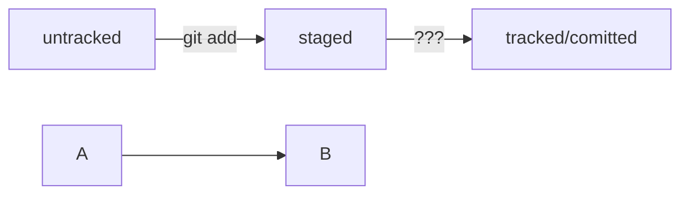

# Инструкция по использованию Git

## Генерируем SSH-ключ

### Что такое SSH

Когда компьютеры обмениваются данными в сети, они следуют **сетевым протоколам** (англ. network protocols) — правилам обмена данными между компьютерами.

SSH использует пару ключей для обеспечения безопасности — публичный и приватный: 
- Приватный ключ (англ. private key) хранится только на вашем компьютере и не должен передаваться кому-либо ещё. Он используется для расшифровки данных.
- Публичный ключ (англ. public key) доступен всем и используется для шифрования данных. Они могут быть расшифрованы парным приватным ключом.

# Commits in Git

## Head

При вызове команды git log вы также могли заметить надпись (HEAD -> master) после хеша одного из коммитов. В этом уроке расскажем, что она означает.

